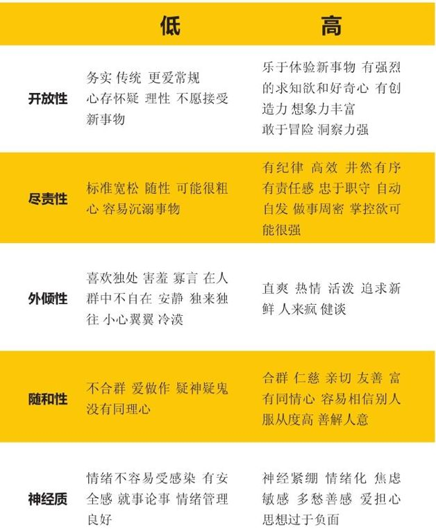

# 读《20 岁，光阴不再来》

这本的封面和名字看上去像是一本鸡汤书，可能你看了第一眼后就不想再翻开读一读了，但是我却把这本书认真看完了。因为我是最开始在网易公开课上看到了[本书作者 Meg Jay 的 TED 演讲](https://open.163.com/movie/2013/3/U/A/M937IFCGB_M937IJLUA.html)，当时觉得很有启发，然后就专门去找了这本书来读，简直是相见恨晚，就好像是找到了人生问题的标准答案。（如果你没那么多时间看书，墙裂推荐先看一下那个公开课视频，只需 10分钟）

这本书使我清醒地认识到，“走一步看一步”、“活在当下”这种佛性的想法和心态是非常幼稚和不负责任的，如果我们不去主动为自己做选择，那么最终只能陷入被动。几乎每个 20 多岁的年轻人都迷茫过，说实话，面对这个年纪的不确定感，最近几年我一直都感到彷徨和焦虑，一方面，是因为我不知道我究竟想要什么、能做什么，另一方面，也不知道应该做些什么，一路走来，如履薄冰。

读了这本书后，我既感到失落又感到庆幸，因为这本书中提到的 20 多岁应该关注的三个主题：**事业、爱情、成长思维**，我只能算是做对了一半（`0.8 * 工作 + 0.6 * 成长思维 + 0.1 * 爱情 = 1.5`），不过还好，我“才”刚过 26 岁生日，一切为时不晚。

## 大纲

- 第一步：认清现实
  - 有些事情不要拖到 30 岁
  - 请在年轻的时候为未来的自己拿好主意
  - 别让你的 20 多岁除了年轻一无所有
  - 20 多岁的不确定感
  - 无论如何，都要立即行动

- 第二步：我们能做什么
  - 1. 打造自己事业
    - 积累身份资本
    - 建立弱连接
    - 发现自己的特长
    - 不要随大流，要听从内心的声音
    - 不要老是说“我不想做这个，也不想做那个”，多想想自己想要成为什么样的人

  - 2. 选择自己未来的家人
    - 爱情和婚姻这种事，最不能随缘，不能拖延
    - 不要浪费时间在不能结果的感情上
    - 找对象其实就是在找未来的家人
    - 不要轻易婚前同居，更不要因为同居而顺水推舟地结了婚，结婚是件慎重的事情
    - 宁缺毋滥，斩断烂桃花
    - 因为“相似”，所以相爱

  - 3. 抓住最后的机会，马上行动起来
    - 20 多岁是最后一次改变自己的机会
    - 学会理性思考，积极思考，不被情绪所控制
    - 用成长思维去看待问题，成功和自信离不开“一万小时法则”（另外一个讲“如何建立自信”的演讲也提到了类似的理论）
    - 不要觉得晚结婚晚生孩子没什么问题，问题大了
    - 给自己制定一份时间表，精确计算未来

### 第一步：认清现实

> “可以说，成长和发展都会有自己的关键时期。在这一成熟期里，通过来自外界适当的刺激，能力会得到迅速的发展和提高。在这段时期之前或者之后，要实现这些就很困难，甚至是不太可能的。”
> ——诺姆·乔姆斯基，语言学家

#### 1. 有些事情不要拖到 30 岁

- 20多岁才不会变成无关紧要的停工期，而是发展过程中一个关键时期，一旦错过就不会再出现。所谓的关键时期是我们成长、变化的黄金时期，在这个期间内，我们已准备妥当要成长或改变，只需要暴露在适当的环境下，就能产生惊人的转变：像小孩子在5岁前听到的各种语言，都能轻而易举学会；又如我们在3—8个月大期间，会发展出双眼视觉……这些关键时期就是机会的窗口，此时的学习尤其迅速。一旦错过，学起来就没那么容易了。

- 科学研究表明的事实
  - 智力方面
    - “20—29岁时期，情绪脑已经发育完备，但是掌管前瞻性思维的额叶却还在疯狂生长。人的大脑还会重复婴儿期的流程，形成第二次的关键成长期。大脑会再一次长出无数的连接新芽，大幅提升我们学习新事物的能力。过了29岁，我们再也没有这样的机会任由大脑产生无数的新连接，再也无法这么快就学会新事物，再也无法这么容易就成为我们理想中的人”
  - 性格方面
    - “塑造性格从而改变命运幅度最大的以及最后的一次机会，不是几岁，不是十几岁，而是20—29岁，一旦错过此生不再来。”
  - 婚姻和生育方面
    - “在20—29岁期间同居经历越多的人，婚姻质量越差，离婚率越高。人的生育能力会在20多岁末期达到高峰，一过30岁，立刻下降为原来的1/2，逐年惊人递减。”
  - 人脉、工资和事业方面
    - “你此生的贵人并非死党，反而是20—29岁中和你交情最浅的路人。而你一生中的工资增长，其实有2/3发生在工作的头十年，而并非你想象的三四十岁之后。”

- 有 80% 决定你人生的时刻发生在35岁之前，你的 20 多岁是极简单却极具可塑性的时期之一，它决定了你的事业、爱情、幸福甚至整个世界。

- 当然，你可以选择拖到 30 岁再拼命，但是上述的科学事实已经告诉我们，拖过29岁，你的大脑可塑性、处理事情的能力、学习新事物的能力、性格可塑性、婚姻质量、生育质量、人脉与贵人、起薪点和事业定向……一切都烙上了很难翻牌的劣势印记。

- 20多岁有它需要解决的问题，而30多岁，也有属于那个年龄的奋斗主题在等待着你。

- 20多岁，正是成年生涯的关键时期。这十年，是我们最容易开始自己理想人生的关键期，不论我们做了什么，20到29岁都是个转折点，一个大重整的机会；这段期间经历的所有事，将大大影响我们未来的成年生活。

#### 2. 请在年轻的时候为未来的自己拿好主意
- 20多岁的10年是发生转变与建立基础的时间。

- 我们要把眼光放远，不止是为了20多岁充实度过，还是为了要有像样的30多岁、40多岁，有些事情非得从20多岁就开始经营不可。

- 希望从别人的故事里，我们能得到的是如何面对未来的准备，而不是“如果早知道这些就好了”。

#### 3. 别让你的 20 多岁除了年轻一无所有
- 苏格拉底曾经说过：“未经过检验的人生，根本不值得去活（The unexamined life is not worth living）。”这个说法被很多治疗师奉若圭臬。但是美国心理学家谢尔顿·科普也说过：“没真正活过的人生，根本不值得去检验（The unlived life is not worth examining）。”虽然后者不是那么有名，可是在这种情况下更为重要。

- 现在才有所意识，还不算太晚，但是凯特必须有所行动了。

- 弗洛伊德曾经说过：“爱和工作，工作和爱……人生除了这两件事，再无其他。（Love and work, work and love...that’s all there is.）”和过去相比，现在年轻人对这两件事的实施，来得越来越晚。

#### 4. 20 多岁的不确定感

- 美国有五千万年轻人处在20多岁的年龄段，他们大多生活在令人咋舌的、史无前例的不确定性中。他们不知道自己将来要做什么，住在哪里，将来要成为什么样的人；他们不确定自己什么时候能快乐起来，什么时候才能支付得起账单，什么时候能遇到一份真正的爱情；他们怀疑自己将来是否有家庭、长久的婚姻，甚至怀疑自己是否适合当下从事的职业……**他们的生活中有太多的“不知道”“不确定”，但其中最让人担心也最重要的是，他们不确定自己的生活能否有出路，不知道要做些什么。**

- “不确定”分散人的注意力，它让很多人焦虑，是21世纪的“大众鸦片”。像凯特这样的20多岁的年轻人为其困扰，觉得什么都不错，却不知道自己最终能得到什么。他们觊觎最好的生活，却在实现目标的路上越走越迷茫。有的选择中途退场，有的则选择一味逃避，浑浑噩噩。

- 我们认为，20多岁没做完的事儿，到了30多岁就可能水到渠成。我们以为，现在不做决定，以后再做的话会有更多选择；**然而我们却忘了，不做选择本身也是一种选择。很多人的青春就栽在了这点上。**

- **如果把很多事情都留到以后做，那么，30多岁时你一定会面临巨大的压力**。毕竟读研深造、职业晋升、挣钱买房、结婚生子、享受生活诸如此类后续的人生选择是有冲突的，就像你不可能一边读研深造，一边创业打拼。鱼和熊掌不可兼得，一个人要在30多岁的时候同时完成所有的事情，除非你有雅典娜的智慧和中彩票的运气，否则几乎不可能。

- 一张胡乱拼凑的简历曾是20多岁洒脱不羁的象征，但是三十好几的人拿出这样的简历不仅难以让人信服，还会让自己尴尬。

- 千禧年后的中年危机表明，因为我们忙着体验生活，不愿错过任何事儿，反而让自己错过一些极为重要的事儿。到了中年才发现，把事情留到以后再做，并不意味着到了以后会做得更好。

- 我见过太多聪明、个性好的中年人，或多或少后悔太晚才开始自己的人生。当他们坐在我的办公室里，对着自己和我回顾20多岁生涯时，不禁会问：“我当时在做什么呀？到底在想什么呀？”

#### 5. 无论如何，都要立即行动

- 我们必须刻意经营，加上一些有用的咨询，否则人生就会像本章开篇的诗歌那样，留下永久的遗憾。

- 我的一位同事喜欢把20多岁比喻成飞机，一架从纽约飞往西岸的飞机。刚起飞时只要一丁点的航道修正，就能决定是要降落在圣地亚哥还是西雅图。然而，如果飞机快到圣地亚哥时让它改飞西北边的西雅图，就要多绕一大圈路线，还要看燃油够不够。

### 第二步：我们能做什么
#### 1. 打造自己事业

#### 1.1 积累身份资本

> “人不会自动长成大人，大人是捏出来的。”
> ——凯·海默维兹，社会评论家

> “我们的出生并非一次完成，而是一点一点生出来的。”
> ——玛丽·安婷，作家

- 海伦的爸妈又气又心疼，开始唠叨：“过来人的话早就跟你说了吧？不听啊！”如今，海伦希望借助一次好的“静修”，或者说理疗中和朋友的闲聊，找到自己真正的人生坐标。她想得很简单：这样一来，她不就可以重启自己的人生了？作为治疗师，我只能实话实说地给她泼一盆冷水：**“对于这点我不是很确定。但可以确定的是，长时间的苦思冥想，对于20多岁的人非但起不到效果，还可能害了自己。”**

#### （1）算一算，你的身份资本值多少

- 我们都听说过“资本”，那么**“身份资本”是什么？**其实很好理解，它就相当于我们个人资产的总和，是随着年龄增长而累积的个人技能资源。这些是我们对自身的投资，等做得上手、时间够长之后，它们便成为我们的一部分。有些身份资本会以履历的形式呈现，比如学历、工作经验、测验成绩、参加的社团活动记录……有些则比较个人化，比如我们讲话的方式、出身、解决问题的技巧，甚至包括我们的长相，都是身份资本的一部分。随着时间推移，身份资本就一点一滴地积攒出我们的价值。

- 那“资本”可以用来买东西，“身份资本”可以用来买什么呢？这样讲可能更好理解些，在成人的市场里，身份资本就像是一种货币，我们可以用它来买到职位、婚姻……以及那些我们想要的生活

- 那些肯花时间折腾、敢于探索、敢于承诺的年轻人，通常会有更强烈的身份认同感。他们不但有更高的自信心、更强大的毅力，也比较脚踏实地。在探寻身份的过程中，常常会获得许多积极正面的结果，包括更清晰的自我意识，对生活更强烈的满足感，懂得如何更好地处理压力……

- “我鼓励海伦想办法去积累一些个人资本，同时找一些能写进履历的像样工作。”

#### （2）“跑龙套”的实习，反而给履历减分

- 诚然，对于一部分人来讲，生活就是拿到国家奖学金，然后搞定常春藤名校的学位。但是对于更多的人来说，我们的身份和事业并不单单是由大学学位、加权平均分决定的。相比于这些数据，一些具有敲门砖作用的身份资本更有现实意义。然而让人操心的是，海伦在这部分的积累几乎为零（注：比如对于大多数专业来讲，到社会上的企业中积累实习经验比一门心思拿学分绩点更重要）

- 20多岁的一大典型特征，就是在找工作这件事上“高不成低不就”。碰上两次“凑合着干”的工作是常事儿。诚然，这些工作是非常必要的权宜之计，比如我在准备GMAT或者半工半学读研的时候，这些收入至少给我们最基本的自立提供了保障。**然而，大部分没有技术含量的打工，对未来的职业生涯没有半毛钱用处。有时候纵容自己暂时做着这样的工作，然后掩耳盗铃地告诉自己“我这不算是真在找工作”。这种日子很轻松，然而这种没有技术含量的“跑龙套实习”，在未来的HR眼里，反而会为你减分——代表着你的一段迷失期**。好歹也算是大学生，毕业了却跟中专生没啥区别，从事了太多没技术含量的“散活”，比如在咖啡店端盘子，或者在一共不到10个人的公司发广告传单……很容易给人一种“退缩不前”的印象，不仅在求职中帮不上忙，反而给我们的履历减分。

- 生活在继续，而你在倒退。你在这样的工作上所花的时间越长，就越有可能变成这样的人（注：这里指的是“跑龙套”的工作）

- 我见过太多20多岁聪明风趣的年轻人，他们刻意地避开现实世界里真正的工作，多年来甘心屈就于那些“跑龙套” 的实习，时间久了，人就渐渐地丧失了奔跑的能力，变得身心俱疲、孤独、不合群，再也没有力气去找一份真正喜欢的工作。

- 经济学家和社会学家一致认为，20多岁的工作对我们长远的职业生涯规划有着不可忽视的影响——**每个人一生中的工资增长，有三分之二发生在工作的头十年**。之后，房贷和家庭开支就会成为一个人继续深造，或者外地调派的绊脚石，涨薪的幅度随之变得越来越小。美国统计局最新的数据显示：平均来说，一个人一生薪资的高峰是在40岁。

- 现实证明，延迟出发的人，很难追上那些提前上路的人。难怪许多人到了三四十岁，还必须为20多岁胡乱打零工的行为付出覆水难收的代价。日子就是“一步错，步步错”，失落会导致悲观，进而选择破罐破摔的大有人在——酗酒、抑郁……这些不良后果就屁颠屁颠地在中年之后接踵而来。

- **以目前的经济形势来看，很少有在30岁之前没做过“跑龙套”实习的人。那么20多岁到底该怎么做？好歹，并非所有的“跑龙套”都一样——有些职位就能带来很高的身份资本积累，20多岁的年轻人一定要擦亮眼睛，找到对的路。**

- 现实往往是，如果你选错了方向，那么停止也是一种前进。

#### （3）人生道路是“捏”出来的

- 天上不会凭空掉馅饼。有一句谚语是这么说的，你想嫁个百万富翁，先看看自己有没有五十万的身价配得上他。同理，你要先有一个好的身份资本积累，好的工作机会才会从天上掉下来。

- 但是说实在的，从我毕业之后，真的没有人问过我GPA成绩——那可是在学生时代引得无数考生尽折腰的指标啊！除非你想走读研的路，否则成绩在你拿到毕业证的那一刹那，就变成了过眼云烟。而且，我们曾经无限纠结的“专业选择问题”，毕了业才知道，其实就是你念错了专业，也真的没人在乎。现在想想当初老爸老妈恨铁不成钢： “你学艺术，以后能当饭吃吗？”现在对我来说，已经是一笑而过。我认识的人当中，真正一毕业就知道自己想干什么的人，几乎为零。我们现在做的工作，往往是在读本科的时候，自己压根没听说过，甚至有些新兴行当，当时在这个地球上还不存在。（注：真希望当年有人告诉我这句话）

- 所以现在是悔不当初啊！**早知道大学刚毕业那几年应该积极地去“霍霍”一下，让自己尝试更多类型、更多领域的，只为趁30岁以前，在职场上多历练历练**。在迷茫的那些日子里，我真的不知道如何是好，内心承受着很大的压力，想什么都特别负面，也毫无效益。一路走来，我收获了一个教训：**人生的道路不是“想”出来的，而是自己按照规划，一步步“捏”出来的。**

- 当你不努力奔跑的时候，这个地球依然在转——你的同龄人正选择了积累身份资本的工作，差距就这样一点点拉开。

- 当海伦用自己已有的一丁点资本去赚取她想要的下一份资本时，海伦的生活就开始注定不同了

- 几千年前，苏格拉底说“认识你自己”，不仅仅是哲学领域的命题。当你在这个苦兮兮的世界里拼杀得头破血流，百思不得其解的时候，回首反观自己的内心，积累、规划，你会捏出一条属于自己的路。**你腔子里的这口气，浑身积攒的本事，就是你最好的资本。**

#### 1.2 建立弱连接

> “那些只在‘朋友圈’厮混的家伙可能永远不会知道，此生的贵人并非是圈内人，反而是我们想象不到的路人。”
> ——罗斯·柯泽尔，社会学家

> ‘Yes’这个词的力量让你得到人生中的第一份工作、下一份工作、另一半，甚至是你的小孩。就算情况有些棘手，就算必须踏出舒适地带，只要肯说‘Yes’，你就能得到新工作、结识新朋友，或说有新的作为。”
> ——埃里克·施密特，谷歌执行董事长

- 收到那箱书大约一年之后，我开始想写书。由于我辅导和授课的学生都以20多岁的年轻人居多，我能深切地体会到他们青春的迷茫，需要并且渴望有人能帮助他们走过年轻的困惑。于是，我想写一本关于20多岁年轻人的书，将我在教学、研究和临床咨询上累积的相关认知全部整合，能让全世界迷茫的年轻人从中受益。这本书之所以出版，就和成年后的大多数事情一样，是一种神奇的“弱连接（weak ties）”力量。（注：作者通过一次偶然的机会获得了写书的启发，来帮助更多的年轻人）

#### （1）送你热汤的朋友，送不了你未来

- 正因为小圈子文化好处多多，20多岁的年轻人多半只愿意和志趣相投的人混在一起，圈子越来越封闭，有些人更是唱着“世事千百万，知己一二三”的歌词——真的就只和那两三好友联系。然而小圈子文化虽然能在失意时为我们疗伤，却无法在得意时帮我们飞黄腾达。城市族群会在我们生病时“一碗热汤慰寂寥”，然而真正能使我们人生快速而富有戏剧性改变的，往往是那些与我们萍水相逢，永远不可能成为死党的路人。

- 研究指出，超过四分之三的研究对象，是通过那些点头之交甚至完全不熟的朋友帮忙，才找到新工作的（注：我的第三份工作就是一个点头之交的朋友引荐的）

- 根据格兰诺维特的说法，并不是所有的关系和连接都是相等的。有些很弱，有些则很强，而连接的力量会随着时间和经验逐渐增强。由于经验和秘密的共享，我们与某人相处的时间越长，连接也就越强。

- 什么是“弱连接”？弱连接则指那些我们见过面，偶尔联系，但是还不太熟的人。他们可能是某位鲜少交谈的同事，或仅限于见面打声招呼的邻居。我们多少有一些想深入交往但迟迟没约出来聚聚的人，或是多年未曾见面的旧相识。弱连接也可能是我们的前任老板、大学里教你的教授，或者一直保持“君子之交淡如水”，却未曾进一步发展成密友的朋友。

- 为什么有些人可以进一步发展，有的人却不行？
  - 一个世纪的社会学研究和几千年的西方思想，一致指出“相似性产生关联性（similarity breeds connection）”的原理。我们会“物以类聚”，正是因为彼此相像，因为出于本能，我们都喜欢和与自己相似的人在一起。无论是学校操场还是董事会议室，人们自然而然就会与聊得来的人形成小圈圈。

- 在强连接里，我们感觉很舒服，有“与君初相见，有似故人归”的亲切感。但是除了彼此聊得来之外，很少能给对方实质性的帮助。因为彼此太相似了——甚至是连困境都相似——所以，除了陪着对方同病相怜，能给的帮助很少。何况，大家都是半斤八两，对职业和感情生活的认识都在同一水平上，谁辅导谁啊！所以，另外一位社会学家罗莎·柯泽尔将其称为“强连接的弱处”，或者说是，亲密朋友对我们的束缚。（注：个人认为作者对于“强连接”有点贬低了，再不重要也不至于这么弱，在哪都流行“找关系，不过也许我没理解作者的要表达的意思）

- 相较之下，弱连接感觉就很不同了。或是因为个体差异极大，或是因为住得很远，不可能结为密友。但这正是重点所在！**由于弱连接不在我们的封闭交友圈里，反而能够引领我们接触新事物，自己熟稔的领域，在对方眼里都很陌生。透过弱连接，咨询和机会的传送远比透过密友圈更远更快——因为弱连接的人脉很少重叠。弱连接就像是一座桥，你看不到对岸，所以无从得知他们会带你到何方**。

- 强连接的朋友圈里都是自己人，沟通时自然倾向于简单却不完整的“限制语法”（restricted speech），也就是我们通常所说的“圈内行话”。同一个朋友圈的人不仅习惯用相同的俚语，而且基本上三观雷同。他们可能念同一所学校，或者抱着对爱情一样的态度，甚至看同一个类型的电视节目。无论是什么特别原因让我们如此相似，总之，**常和强连接的人混在一起，会局限我们认识的人脉、知道的事情、讲话的方式，最终禁锢我们的思想**

- 另一方面，因为弱连接与我们之间的差异，让我们沟通时必须选择“精致语法”（elaborated speech）。使用“限制语法”的前提是听者与说者的认知背景相似；然而“精致语法”则不然，它不会假定听者和说话者会用相同的方式来思考，或说知道相同的信息的。**当和弱连接说话的时候，我们需要说得更加全面。这就需要更多的言语组织和反思**。像“你知道的”的收尾语也会更少，一句话再也不会那么轻易地草草结束。不管我们谈论的是职业话题，还是对爱情的思考，我们都得把自己要说的说得更加全面具体。这样一来，弱连接就会促进——有时甚至可以说是迫使——我们提升并且改变思维。（注：一个比较常见的例子就是程序员跟设计师和 PM 解释一个功能的实现时）

#### （2）如何把路人变成贵人

- 每当我好心鼓励20多岁的年轻人善用“弱连接”的力量时，经常是碰了一鼻子灰。这群家伙总是一麻袋理由：“最烦靠关系了……”要不就是“我想凭自己本事找工作”，再或者就是“这不是哥的风格”。但事实就是事实，在找工作、找对象等等机会的面前，与我们交情最浅的人，往往能给我们带来最大的转变。况且，所有的新事物几乎都来自我们的小圈子之外。总之，没有善用弱连接的年轻人，最后会沦落到给善用弱连接的人打工。

- 动用关系、善用人脉……并不是什么丢人的事儿。我一向用一种很客观的角度看待这件事儿，不像我的某些朋友，觉得要是通过家里关系找工作，一定在朋友面前抬不起头来

- 好多人认为“别人都认识好多人脉，就我没有”。说这话的人，一定没意识到自己还有很多可挖掘的资源，只是一直没有开发。

- 大多数20多岁的年轻人渴望有群体归属感，所以喜欢紧紧抓住强连接也是人之常情。但是讽刺的是，当我们深陷某个小圈子时，反而会有更强烈的疏离感，因为我们和这个小圈子的人一起变得孤立、与世隔绝。时间一长，我们最初想要的群体归属感，逐渐演变成一种与外在世界隔离的感受。（注：估计这也是为什么很多年轻人单身的原因之一吧）

- 真正的相辅相成关系，不是半夜一点给最好的死党发微信，而是去接触那些能给我们的生活带来巨大变化的弱连接（就算目前生活还不需要改变也要早早积累）。有了弱连接的协助，我们周围的其他圈子——特别是20多岁年轻人削尖脑袋想加入的圈子，看起来也就不再那么高高在上、深不可测了。突然间，世界好像变小了，小到更容易找到切入口了。总之，我们越懂得事情运作的方式，日后就越得心应手。

- 到底怎么善用弱连接，把路人变成贵人呢？
  - 请求帮忙是开始的第一步。本杰明·富兰克林效应就是个典型例子。
    
- 富兰克林效应：让别人喜欢你的最好方法不是去帮助他们，而是让他们来帮助你。如果想得到别人的好感，主动开口是没坏处的。因此，千万不要“怕麻烦别人”，其实那些曾经帮助过你的人会更愿意再帮你一次。
    
- 我们常以为，只要人家喜欢我们，就会帮助我们，因为圈子文化里的运行模式就是如此。不过，从富兰克林效应（Ben Franklin Effect）以及随后的经验主义研究证明，事情的运行模式正好反过来：我们往往要依靠那些并非很熟的人帮忙。
    
- 一旦弱连接帮了我们，他们中的一些人就会开始喜欢我们，有些甚至会变成我们生命中的贵人。

- “登门槛策略”（Foot-in-the-door technique），也就是我们俗称的“得寸进尺法”，也和富兰克林效应相近，亦是先从小的要求开始，再慢慢提出更大的要求。两者同样指出，一个协助会衍生出更多的协助，假以时日，就从帮小忙变成了帮大忙。

- 为什么一个人，尤其是年纪更大或说更成功的人，更有可能在最开始的时候出手帮助别人呢？
  - 答案很简单，人性都有一种心理——为善是好事，送佛送到西。所谓“助人者的快感”（helper's high），就是来自慷慨的善行。许多研究指出，利他行为可以带来快乐、健康和长寿——前提是这样的帮助对我们不造成负担。

- 那么，什么样的要求会让人望而却步？
  - 提出的请求或者问题要明确
  - 研究一下目标对象能做什么？保证自己的要求合乎情理，请求的可操作性要强，不要不切实际
  - 让别人对你感兴趣，并设法拉近关系。事前做好功课了，理清自己想要什么，然后客气地请对方协助。

- 我们20多岁时，唯一能做的最棒的事，就是接纳弱连接，也给他们一个理由接纳我们。研究指出，**当我们成年后，随着年龄增长，我们的社交圈子实际是越来越窄——随着家庭和工作越来越忙，我们和外界的界限也就越来越分明**。所以，每当我们换工作、搬家、换新的合租室友、周末去闲逛的时候，正是认识新朋友、接触新观点的时机，不要只把时间花在和同一群人聊天上，抱怨“我的前任是极品”或者“我的老板是奇葩”这样的话题，真的一点用也没有……

#### 1.3 找到自己的特长

> “不确定性永远是承担责任前的必经过程。”
> ——哈罗德·杰林，商人

- 伊恩跟我说， 他20多岁那些年，就像是大海中一条不会游泳的鱼。在浩瀚无边的水中，无论朝哪个方向看，都无法找到陆地，不断地呛水，不知道何去何从。已经过了“可以游向任何地方，做任何事”盲目乐观的年龄，也不知道该做哪些“任何事”才能成功。

- 不管你承不承认，你不知道人生该怎么过，不知道下一步该怎么走，其实是为了抗拒“我的生命我做主”的恐惧感，不愿去想未来迟早要独自面对，以为逃避，就可以假装“现在”无所谓。换句话说，**面对选择而不知所措，实质上就是人类不想承担责任的天性体现。**

- 像伊恩这样20多岁的年轻人，从小就听惯了各种模糊不清的“大口号”，比如“天生我材必有用”，“有梦想就有未来”……但是这些“大口号”都没告诉我们到底该如何实现梦想。我们渐渐不知道梦想的路在何方，甚至连梦想，也随着年龄的增长慢慢地丢了。

- 20多岁的年轻人常说，选择太多了简直无从下手。可是，此时此刻的伊恩发现，他眼前的选择并没有大家说的那么多。何况，越是逃避，越晚起步，选择就越少。

- **“我们的社会总是告诉20多岁的人：‘因为拥有无限选择，所以才叫青春！’我们听到的都是‘做自己想做的，走自己想走的’，如同你所描述的大海，也像是站在24种口味的摊位面前一样。然而，至今我还没听过哪个20多岁的人能有24种以上的可行方案供他选择……事实上，每个人只要从自己的6种口味摊位上选择即可，最多就只会有6种。”**

- **“你已经花了20多年的时间塑造自己。你有长处，也有短板；有各种琐碎的小事，也有很多必须要处理的要事。你不是这一刻才降落在地球上的，就如你所说‘掉进海里的’。过去的25年和现在有剪不断的关系。你就站在6种口味的果酱面前，而且你知道自己是更喜欢猕猴桃口味的，还是更喜欢黑樱桃口味的。”**

- **伊恩假装自己的困难点在于不知道该做什么，但在他内心深处，我觉得他其实很清楚：做出选择会启动真正的不确定感。这种不确定感更恐怖，因为你选择做某件事，却不知道该如何开始。明明什么都不确定，却还得硬着头皮做。一旦真做了选择，我们就得赶鸭子上架一样不得不努力，必须得承受未来可能的挫折和失落。所以，有时候我们不知道、不选择，感觉上反而轻松多了——因为不做，就永远不会出错。但事实上并非如此。**

- 他随即又丢出一火车的问题，证明自己真的“什么都不知道”。
  - “可我真的不知道怎么才能进入这个圈子……”
  - “我知道。”
  - “那要是我开始去做，没过两天改变主意了该怎么办？”
  - “那就改做别的啊！这又不是唯一的那瓶果酱，你还可以选其他口味啊！”
  - “那我要是没做成，这些努力不是就白费了么……这瓶果酱不就作废了么？”
  - **“不会白费的。你反而会更了解这个选择。你该问的问题是：这份工作能养活自己吗？自己到底喜不喜欢？你必须自己一一找到答案。”**
  - **“我总是想太多。总觉得一件事应该能确定做了一定会成，才应该开始。否则还不如不做，感觉倒是更安全……”**
  - **“不做选择一点也不安全。只是现在还看不到后果，等你到了三四十岁，那些后果就噼里啪啦地全来了。”**
  - “我一直担心父母会有意见……他们说我应该去念法律之类的专业，社会地位比较高。或者，我想我应该做点更加有趣的事情，比方说和阿拉伯语相关的事情……我的人生不该只是一瓶果酱。那样太无聊了。”
  - “嗯哼，在你认清自己想要的并准备行动之前，还有一个绊脚石要提前移开，那就是‘应该的暴行’（tyranny of the should）。”

#### 1.4 不要随大流，要听从内心的声音

> “要求完美反难成功。”
> ——伏尔泰，作家，哲学家

> “若我们只想要幸福，这很简单；但是当我们要比别人过得幸福，却难于上青天——因为我们总是把别人想象得比他们实际状况快乐得多。”
> ——查理·路易·孟德斯鸠，作家，哲学家

- 对大多数人而言，facebook不是用来“找”朋友的，而是拿来“看”朋友的

- Facebook上天天上演着人气血拼，越多的“赞”才代表着越高的境界。所以你唯一能做的，就是表现出你最完美的一面。总之，我们必须实时晒出日子最光鲜的一面，然后把“光鲜”透过滤镜的修饰上传新鲜事。Facebook不是用来呈现真相，而是展现 “表相”的场所。 Facebook不仅让我们更新朋友近况，更要我们跟上他们的水平。

- 大多数20多岁的年轻人不会傻到去和facebook“名人堂”用户的生活作比较，却轻易把朋友在facebook上晒的照片和状态当真。然而，其实大部分人都是“家丑不可外扬”，在个人主页上报喜不报忧罢了……像塔莉亚这样的年轻人很多，在facebook上不但没有找到鼓励和归属感，反而更加焦虑和孤独。

- 如何发挥潜能势必是一个大问题。有些人梦想太小，他们不知道20多岁的选择意义非凡，对未来有决定性的影响；有些人则是梦想太大，好高骛远，不切实际。要了解自己的潜能，就是要承认我们的特殊天赋和局限是怎样契合周边的世界的，这样我们才会知道真正的潜力是在哪里。

- 或许facebook让我们认为，20多岁的青春看起来就应该比实际更美好。总之，当我们的所见所闻都是“理想状态”，我们反而越来越看不清眼前这个真实的自己和世界。

- “你应该怎么怎么样”会伪装成高标准或极高的目标，但它毕竟不是目标。目标能够由内而外指引我们，“你应该怎么怎么样”却只会从外边瘫痪我们的判断力。目标像是真实的梦想，“你应该怎么怎么样”则像是沉重的义务。伴随着“应该”而来的是错误的两分法：成功或是失败，完美或是残渣。“应该的暴行”会逼我们放弃对我们自己最有利的事物。

- 一个人的天赋，其实不会在20岁的时候显现，反而是到了三四十岁才慢慢发挥出来——这和我们所谓的“常识”刚好相反。在发挥潜能之初，通常我们要做一些看起来不太对头的工作

#### 1.5 不要老是说“我不想做这个，也不想做那个”，多想想自己想要成为什么样的人

- 差异性造就了我们，也赋予我们人生意义。

- 在这个社会，想要与众不同太简单了。就像我们在解释什么是黑，最明了易懂的方式就是说它是“白色的相反”。同理，我们对自己最初的了解，通常不是来自我们“是谁”，而恰恰来自我们“不是谁”。我们用“我不是这样”、“不是那样”来定位自己，就像伊恩一直在碎碎念，“不想整天待在同一个电脑屏幕前”是一个道理。**可是，自我定义不能单单用这种方式，毕竟我们的身份或工作并非由我们“不想要的一切”构成。因此，我们必须学会跳脱负面身份到正面身份，从“我不是谁”，变成“我是谁”。不过，这需要勇气。**

#### （1）如何个性化定制自己的人生

- 要做到真正的自我定义必须勇敢说“要”。换言之，伊恩必须把焦点从“我不要这样的生活”转移到“我要怎样的生活，我可以做什么”。我跟他说：“说不要很容易，但是你究竟要什么？

- 我问他，希望我对他儿子说些什么，他说：“好的事儿不会像魔术师帽子里的兔子，到他30岁时突然蹦出来，我会叫他趁早在20多岁就开始准备。”

- 我问伊恩，相较于批量生产又方便维修的普通自行车，他希望透过量身打造的车给别人怎样的印象？他说，这辆车不仅仅代表着零件，也不仅仅代表着某个牌子，这种个性化定制，就像是对自己期望的代言：他希望拥有非凡而丰富的人生，而且要无与伦比。然而，他企图在不同的店找寻不同的解答，就像他20多岁的人生。
  - 我问他，是怎么拼出一辆车来的？他说先到店里，给自己定做自行车架和轮胎，而车架要根据自己的身材和骑乘要求量身打造。接着他会列出偏爱的各种零件清单，最后经过组装后，拿到一部合意的车。在他逐步增加配件的同时，这辆车变得越来越实用而且与众不同。虽然过程少不了花时间和银子，但是伊恩乐在其中；因为这辆车是他的个人创作，对他有着特殊意义。
  - “这么说，量身定制的自行车很适合你喽？”
  - “那必须的。”
  - “而且它必须独一无二。”
  - “对啊！”
  - “感觉上它既是正品，又与众不同，况且从某种意义上说，它甚至是没有限制的，因为你随时可以更换零件。”
  - “对头。”
  - “可是刚开始时，你还是得用标准配件。你该不会连轮子都自己研发吧”
  - “当然没有啦”
  - “**你看，或许真实独特的人生也是这么来的啊！现在是什么年代了，事业和生活都不再是从生产线上直接加工出来的，我们必须自己拼接好自己的人生片段。你的人生可以非常个性化，但同样要付出大量的时间和精力，而且像拼自行车一样，要从那些最普通的零件开始。想要拥有非凡的人生，不一定要排斥这些寻常的选择，它们才是创造非凡人生的基础，一如你的自行车。**”

- 如今，伊恩学会一次只专注一件工作或者一项资本上。这样似乎没那么恐怖，也不用担心自己的下一步会注定下一辈子的生活。

#### (2)简历不是卖身契，如何脱颖而出
- 从这些经验里我学到一件事：对于找工作的20多岁的年轻人来说，一个好的故事尤为重要，比其他时期都重要。这时大学才刚毕业，履历表上列不出什么像样的经历；因此，个人叙事就成了少数几样能在这个阶段脱颖而出的事。20多岁的年龄，人生潜力无限，但是成就屈指可数。能够说一口好故事、生动地介绍自己以及自己梦想的人，比其他同龄人更占优势。

- 在这些繁琐资料里，主角必须现身，讲一段经常的故事。否则，履历表就只是张清单，清单可一点也不吸引人

- 什么才是精彩的故事？
  - 如果说建立身份资本的第一步就是要说出我们的兴趣和专长，那么第二步就是要说出一段与我们兴趣和专长相关的故事，无论是面试或约会聊天都能派得上用场的故事。不管你是治疗师还是面试官，故事要兼具内涵和结构才能独树一帜

- 不论你是申请读研还是工作的offer，它自有一套游戏规则。面试官希望听到合理的故事，清楚地交代过去、现在和未来。换言之，你过去所做的和你现在要做的之间有什么关联度，对你未来要做的会有什么影响？

- 如今我又走到了人生的另一个十字路口，我不想再继续现在的工作——真的受够了！但是同样头疼的是，我得重新思考，下一步该怎么走？好在这次容易多了。**因为上次的经验告诉我，我必须采取行动，摇摆不定的话，什么事也做不成。**

- 有时我觉得做了选择以后，人生变得狭窄而苍白。**就算选择了追求自己喜欢或适合自己的事情，日子久了还是会感到苍白，只因为它们合乎常理。**我渴望走不一样的路，像是学阿拉伯语！像是去柬埔寨！我知道这样的想法很疯狂，也知道要活出美好人生，不能只做自己喜欢的事儿，也要做合乎常理的事儿。

- **过去我一直担心自己沦落平庸，或许现在你觉得我就是个凡夫俗子。但我终于了解为什么每个人的人生都是如此，至少从平凡的方式开始，因为生活本是如此。伊恩说得没错，生活本是如此。认定一份职业或者得到一份工作并不是一种结束，而是一种开始。接下来还有很多个未开封的未来，在等着我们**

#### 2. 选择自己未来的家人

#### 2.1 爱情和婚姻这种事，最不能随缘，不能拖延

####（1）尽量早一点关注婚姻这件事，从20多岁就开始

- 你的幸福取决于上了哪张床，而不是上了哪所大学。婚姻不仅仅是女人一辈子的事儿，对男人也是如此。

- **20多岁时，约会对我来说就像玩“大风吹”，大家在场中跑来跑去，不亦乐乎。然后等到了30岁，音乐骤然停止，每个人开始找位子坐下，我可不想成为那个找不到座位的小可怜。有时我在想，我会嫁给我老公，会不会只是因为在我30岁的时候，他离我的位子最近？假如当时多等一阵子，会不会碰到比现在还好的人？或许会，但风险太大了。现在想想真应该早一点考虑婚姻的事儿，从20多岁就开始。**

- 大学里开设了那么多研究符号语言学的高端课，却没有一门基础课教你如何选对象。

- 流行杂志塑造出的“20多岁文化”，是一群对承诺避之不及的单身男女。然而，打开门后我听到的却是完全不同的故事——从那些20多岁的客户口中，我没听过哪个人不想结婚或不想找到真爱的。他们当中，即使忙得脚不沾地，或是年纪轻轻就仕途得意，依然心里渴望爱情，希望找到合适的另一半。只是他们不愿意公开这样的心思，怕被别人笑话老土罢了。就算是一些想尽快结婚的客户，也不好意思说自己急着想嫁人或者急着想找老婆。别看现在年轻人在别的地方浑不吝，在感情上倒是挺迷信，张口闭口都是那个神句：“感情不是我们能控制的，随缘吧！

- 感情不能控制，但是事业可以规划。我们在各自的专业领域发挥所长，相信只要肯用心，铁杵磨成针。在职业规划中，只要遇到了“十字路口”，瞬间就能找到大量的畅销书、课程、学位、咨询、服务……帮你解决问题。这或许是理所当然的，毕竟事业对人生如此重要。然而，相形之下，人们到了爱情的十字路口，能接到的系统性帮助却少得可怜。就像戴维·布鲁克斯说的那样，结婚是一个人一生中最重要的决定，然而恰恰是这一项，别人却没多少资源可以帮你。

- **婚姻之所以是我们人生中最重要的抉择，因为这一纸婚约包含的层面实在是太广了**。就像是赌局，如果说职业规划就像是赌21点，在牌桌玩他个12小时，其间你可以看着手中的牌做决定，依赢面大小判断怎么出牌——你可以放手一搏赌庄家出的下一张牌，也可以选择保守一点。**然而，选择婚姻就像是走到了整张赌桌前，把你所有的筹码全压在32上。**

- 结婚证的红戳戳一盖，你下辈子的很多事就已经定了：钱、工作、生活方式、家庭、健康、休闲、退休，甚至包括死亡，全都成了两人三足赛跑。你人生中的每一件事，都要和与你盖戳的这个人绑在一起。更残忍的是，如果你过得不开心，离婚可不像离职一样，可以轻轻松松说不干就不干了，月底把账结清了就可以从此再无瓜葛。事实上，就算两人离婚了，在财务和孩子的问题上，两人也得绑一辈子。

- 我们虽然常听到年轻人想“趁没结婚好好挥霍一下人生”，但还是有不少人怀抱希望，希望能够幸运地遇上那个对的人，走入一段对的婚姻，不再重蹈爸妈的覆辙。**但很多事，晚做，并不代表会做得更好。**

- 我读研时做的第一个大型研究，就是追踪100名女性从20岁到70岁的成长变化。到了中年时，她们每个人应要求写下一页文字，描述迄今为止最难熬的人生经历。有人写领导是奇葩，有人写前任是人渣，还有的写悲惨的患病经历。**但更多的人，写的都是折磨自己多年的不幸婚姻——有人以离婚收场，有人则继续忍受。**

- 至今仍未有足够的研究证实可以看出晚婚的影响。但是可以确定的是，早婚是各种婚姻组合里最不稳定的。加上近期研究证明，我们要到20多岁才会完全成熟。但是，最新的研究指出，晚婚确实会降低离婚率，但是只适用于20—25岁。一旦过了25岁，结婚年龄对离婚没有绝对影响。

- **年纪越大的另一半或许比较成熟，但是晚婚也有晚婚的问题：20多岁的夫妻，双方人格都还在成型阶段，可以一起成长。相较之下，晚婚的配偶人格已经趋于定型，加上低承诺以及消极的感情关系会造成坏习惯，侵蚀彼此忠诚的爱。再说，尽管挑三拣四比较有机会找到好伴侣，但时日一久，随着身边人各自名花有主，能剩下让你挑的人也会越来越少。**

#### （2）不能结果的感情，就别浪费时间

- 20多岁的男女不该定下来，我所谓的“不该定下来”，**是指不浪费时间在随随便便或者低于自己选择标准的感情上**。换言之，不可能或者不想开花结果的感情就不要谈。此外，爱情篇里我还想提醒各位，现在就应该慎重挑选结婚对象，不要等到30岁，接到朋友一张张喜帖的时候，才开始重视这个问题。

- 建议大家趁着时间还不急，大脑还有时间冷静思考的时候，谨慎选择做正确的事儿，认真过自己的人生。此外，**感情也和工作一样，即使我们准备好了，它不一定会马上出现。我们得用心尝试好多次之后，才可能了解到爱和承诺这两个词的意义。**

#### 2.2 不要浪费时间在不能结果的感情上

- 所谓年轻，就是“你还没把人生彻底搞砸”。

- 我们在工作上对自己这么高标准，为什么一遇到感情就这么没底线？

- 越是完美的人，越难有完美的人生。

- 人的一生中见过成千上万的身体，对其中的上百个产生欲望，走入爱情的婚姻却是屈指可数的。这个人，你要和他做爱吵架生孩子，岁月沧桑，世殊时异，要用一世的婚姻去证明当初的一句话：“Yes, I do.”

- 越是成长背景艰辛的孩子，通常越不知道如何获得理想的爱情。然而，他们比别人更应该倍加谨慎，更需要一个好的伴侣陪伴。

- **挑选你的家人，有时候的确让人心里没底，它一点都没有爱情的浪漫。但你不能什么都不做，只苦等着真命天子的出现。你必须很清楚，你所做的这个决定，会关系到你的下半辈子；你必须明白，你选的人不仅仅要跟你走完20多岁，还要能陪你度过未来几十年的琐碎人生。 大部分的20多岁年轻人，对感情还没有这层戒备和恐惧，也不会考虑得这么远。因此，虽然我很不希望看到艾玛忧心忡忡的样子，但我知道这层担心对她来说是有益的。至少这说明，她意识到了爱情和工作同等重要。**

- 感情关系里过分重视个人的结果，然而我们忽略了20多岁最大的机会：挑选并创造我们自己的家庭。

- 没有人告诉艾玛，在20多岁的年纪，他们随时都可以挑选自己的家人，创造自己的家庭，拥有一个改变人生的家庭，一个彻底影响下辈子的家庭。

#### 2.3 找对象其实就是在找未来的家人

#### （1） 不要轻易婚前同居，更不要因为同居而顺水推舟地结了婚，结婚是件慎重的事情

- 在心理咨询界，有句话是这么说的：“你走得越慢，越快到达终点。”有时候，帮助别人最好的方式就是让他们慢下来，慢到足以检视自己的想法。每个人的论点都有缝隙，若能停下来，用一道光照向这些心灵缺口，会发现那些驱使你做出反应的往往只是假设，而我们自己却没发觉。比如詹妮弗在讲话时，很容易让我们听出她的假设：“同居是检验婚姻的试金石。”然而，这是个最甜蜜的谎言。

- 事实上，先同居再结婚的夫妇，在婚姻满意度上比没同居过的夫妇更低，也更容易离婚。这就是社会学家所谓的“同居效应”。

- 那么，同居效应背后的原因究竟是什么呢？为什么先同居再结婚比较容易离婚？最新研究指出，问题恰恰出在同居本身——顺水推舟，无关承诺。
  - 詹妮弗说的就是所谓的“顺水推舟，却非决定”：从约会到过夜，再到经常过夜，再到同居，一切都像顺水推舟一样自然，不需要戒指，不需要婚礼，有时甚至连谈都没谈过，许多人不想当面讲“为什么同居”，也不想去谈“同居意味着什么”。
  - 当研究人员问20多岁的年轻人同居的原因，女生多半回答想要爱人相伴，男生则多半回答要亲热更容易。一对情侣对同居有两种不同期许，却谁都没说出口，甚至连自己也没意识到，这种情况并不罕见。**不过，男女方倒是一致认为，对同居人的要求要比配偶的标准低。**
  - 就像大多数选择同居的20多岁年轻人一样，詹妮弗和卡特选择住在一起，更像是从大学室友变成炮友，而非一对互许终身的伴侣。他们心中有个模糊想法，利用同居检验一下彼此的爱情，却不敢涉足婚姻相关的领域；
  - “没错！凡事都变得模糊不清，这种含糊不清的感觉让人非常不爽。我觉得自己年复一年都还在妻子试用期内，但是什么时候给我‘转正’？！想到这个我就觉得没有安全感。这段期间我们常工于心计，争吵不断，我从不觉得他是真心想跟我把事儿定下来，就连现在也不是，呜呜！”
    - 詹妮弗的不安全感是事出有因的。要探讨原因，得先弄明白一件事：**所谓同居效应，严格说起来应该是“订婚前的同居”，而非“结婚前的同居”。订婚后同居试婚的未婚夫妻，已经公开且清楚表达了走入婚姻的决心，因此日后的婚姻不会比起婚前未同居的夫妻不幸。换言之，他们应该不受同居效应的影响。**

- 同居的准备成本和转换成本
  - 事实上，同居正是如此，这种情况在行为经济学上称之为“顾客锁定”（consumer lock-in）。所谓“锁定”，是指一旦投资了某样标的，便不太想寻求其他选择或换到别的标的物。
  - 同居就包含了准备成本和转换成本，两者是锁定的基本元素。
  - 就像詹妮弗说的：“家具是我们合买的，我们一起养狗狗，也有共同的朋友；我们有固定的周末行程。正因为这些，实在很难说分就分。”
    - 我表示，“30岁后，重新开始的转换成本一下子变大了！”
    - “其他人都结婚了，我也想啊！回想起来，我和卡特结婚可能也是因为我们俩都刚满30，而且又都同居过一段时间了。”
    - 我说：“过了30岁，赶快嫁人变成了主要矛盾，嫁了人是否幸福倒变成了次要矛盾啊！”
    - 詹妮弗吸了吸鼻子说：“其实有句话我一直没好意思说，但事实上，我真的不太在意我们的婚姻是否幸福。我还想说，就算是最后分开，至少我跟别人一样结过婚了，至少我有跟上进度。”
    - “**所以你先低估了同居的转换成本，接着又低估了结婚的转化成本。**”

- 有些人希望一开始就不要同居，本来可能几个月就分手的感情，居然因此拖了好几年。
  - 基于方便和暧昧而开始的感情，往往会干扰我们，让我们无法认清谁才是真爱。每个人必须非常清楚：我们会和那个人结婚，是因为真心相爱，而不是因为在一起很方便或者分手很麻烦才结婚。
  - 然而，许多像卡特和詹妮弗这样的同居恋人并不会分手。他们从约会滑落到同居，然后不知不觉地被锁进婚姻。结婚对他们来说似乎比瓜分家具、重新开始要容易，尤其是当周围朋友一个个都开始领证、办婚礼、生娃。 
  - 如果能早一点看穿这些道理，我们对“同居”这个词表面的甜蜜就理解得越深刻。我并不是赞成或反对同居，只是希望20多岁的年轻人能够看清楚事实：同居不但不能防范离婚，还可能增加你和眼前这个人锁定的概率，就算对方不合适你也一样。

- 解决方案
  - 某些事有助于降低同居的副作用：首先，同居可以，但一定要在订婚后，这不是我个人的建议，研究报告指出，同居之前必须先确认彼此是真心承诺的，同时要评估有哪些事会牵制你们分手时的抉择。
  - 何况，测试感情的方法不仅仅是同居一种，还可以做很多共同的活动，世界很大，不仅仅只有上半身约会和下半身运动。

#### 2.4 宁缺毋滥，斩断烂桃花

- 人生最可怕的状态，不是不再渴望，而是开始“渴望被别人渴望”

- 我们又花了好几个月帮助她从“被人渴望”转成“我渴望”。在这之前，凯西从未想过她希望另一半具有什么条件，从来没想过自己可以主动去要幸福，从来没想过自己能够掌握爱情的主动权。

- 凯西说：“我终于了解，爱情不是游戏。在我现在所处的人生阶段里，下一个对象就可能是我下半辈子的伴侣，我必须承认，并且接受这样的事实。”

#### 2.5 因为“相似”，所以相爱

> “人们喜欢和自己相像的人。”
> ——亚里士多德，哲学家

- 恋爱是个技术活，但是婚姻是个力气活。一旦迈进了婚姻这个门，就走上了通往房贷、生儿育女等等的长征路。

#### （1）性格比“硬指标”更重要

- **伊莱和女友需要的都是“相似相爱”（in like）。我这里说的有两层意思：关键的地方要相像，而且真心喜欢对方的个性。（译注：like有“相似”之意，也有“喜欢”的意思。）两者通常是相伴而来的。因为愈相像的两个人愈是能够心灵相通，两个人很清楚对方会怎么做，会有什么反应，如此一来可以预先避免很多摩擦。雨天、新车、长假、纪念日、周日早晨、大型派对……两个相像的人会对此采取相同的态度。**

- “异性相吸”这个说法，只对勾搭有效，熬不过婚姻的长跑。**在大多数情况下，相似性是相容性的基础。研究一再指出，社会经济地位、教育背景、年龄、种族、宗教信仰、吸引力、态度、价值观和智力水平上相似的夫妻，更容易满足他们之间的关系，离婚的可能性更小。**

- **但并非所有相似点都对感情有帮助**。因为人们虽然懂得用非常明显的标准进行速配——比如说年龄、教育背景……然而这些特质在研究者看来，却只是所谓的“硬性指标”（也就是那些相似点），而非牵线的“红娘”(媒合者)。**实际上，这些显而易见的相似点却并非媒合者，它可能让两个人结合，却不一定带来幸福。**
  - **个性就是媒合者的一种，必须纳入考虑。研究指出，两个人的性格越相像（尤其是年轻伴侣），对感情生活就越满意。然而，通常在“硬条件”的坚持下，最终和我们走到一起的伴侣，通常个性都不太像。毕竟，个性不是指我们做过的事情或喜欢的东西，它是我们处事的方式，我们所做的每件事都有它的影子。个性就是我们的一部分，走到哪儿都带着它，就算你走到尼加拉瓜也不例外。所以说，我们有必要进一步了解它。**

#### （2）大五性格模型

- 大五性格模型测不出我们喜欢哪些事物，但能帮助我们看清自己，了解自己是怎么过日子的，大五性格模型透露出我们一早起床如何面对世界，又是如何处理每天的是是非非。它可以告诉我们如何体验世界，别人又是怎么看待我们。这很重要，因为无论我们走到哪儿，性格都如影随形。

- 有个事实很残忍，但它却是真的——**我们会落在大五性格模型的哪个位置，其实有50%在我们刚出娘胎就注定了**。我们一出生，个性有一半就已经定型，来自基因、胎教等生物学因素。随着年龄增长，我们的经历也会影响我们与世界互动的方式，但个性的影响一直都在，就像那句俗话讲的一样：“江山易改，本性难移。” 

- **当你明白了自己在大五性格模型中的向度位置，也就对自身性格有了粗略的概念，而对自己在不同情形和时间内的行为也就有了解释。你可以用同样方法去分析熟悉的亲友或者打算进一步深交的人，进而印证你们的个性有多么相像或不像。个性本身无好坏，重点是彼此是否合得来。落在大五性格模型向度的低中高分数，并没有好坏之分；通常我们会喜欢或者讨厌某个人，多半是因为他们的向度和我们的相差太远。**

- 就我的观察，伊莱并不是“社交活动过度”的人；而在临床上，他的女友也没有他说的那么忧郁。多数时候，我们会觉得对方不好，是因为他和我们个性不合。

- **伊莱和女友并不了解彼此，他们误以为彼此是郎才女貌，而且外在也有很多共同点。只是当两个人迥异的个性一再冲突时，他们才感到莫名其妙，而且希望对方能够改变。他们以为在一起越久，就能够变得越像。然而，并没有一定的证据显示，个性会随着时间而相似度提高。**

- **大多数情侣和夫妻的分开，是因为“你变了”，比如外遇，或者其中一个人要远行。然而更普遍的是，人们之所以分手，更多的情况是因为“你没变”：我们时常听到伴侣在分手后分析原因，说彼此的差异一直都没变。**

- **当你决定结婚时，非常可能碰上一个各方面条件都很合适的人。这样的确很方便，但对长期的感情而言，这可一点也不方便。心理学家丹尼尔·吉尔伯特将婚姻称为“通往辛苦工作的大门”，因为它打开了通往房贷、生儿育女等等方面的大门。所以，若从个性切入来选择，就可以看出我们和伴侣能否同甘共苦。**

- **我们和另一半的大五性格模型当然不可能完全同化，不过个性越相像，关系会越好。或许你所爱的人和你真的不像，但如果你懂对方的个性，心里也比较能够释怀，能理解他为什么处事的方式和你别扭。虽然得花好长时间接受彼此的差异，但越过日子你会越明白，这个时间花得很值。**

**延伸阅读**
- [Big Five personality traits - Wikipedia](https://en.wikipedia.org/wiki/Big_Five_personality_traits)

#### （3）是合不来，还是吹毛求疵

- 科特尼说这些时，总是一副受气包的样子，但我真没觉得问题有她说的那么严重。过了几周后，我说：“姑娘，我有点闹不明白啊！我一直在听你有多在意这些事，它们让你有多别扭。**但我们讲这些到底是要证明你跟他合不来呢，还是说你不允许你们二人间有一丁点不同？**”

- 不过我早就发现，马特并没有她说的那么差。事实上，除了某些时候她会斤斤计较马特哪里不好，大部分的时光他们相处得还是挺嗨的。

- **神经质向度如果落在高点，对感情是一大毒害。**
  - **神经质是指容易焦虑、紧张、爱挑毛病而且情绪化，高度神经质比个性不合更容易导致感情不顺或是分手。虽说个性形似可以让彼此过得好，但毕竟世上没有两片相同的树叶，地上也没有两个完全一样的人，因此，如何面对彼此的差异，比差异本身重要得多。在高度神经质的人眼里，一点点的差异都会被放大到相当严重，他们对彼此的差异感到焦虑，进而批判，最后演变成吹毛求疵和藐视——两大感情杀手。**

- 我和科特尼的谈话
  - “你又没说嫁他，再说，就算是嫁他，怎么能说是迁就呢？”我问她。
  - “因为他从不记得送我花！而且他还不看报纸！我是说，他的智商是不是有点问题？”
  - “他不是个蛮成功的微生物学家吗？这样的人智商会有问题？”
  - 科特尼不理我，继续说她的：“我不管，总之我最好的闺蜜说，不送百合花，就是个不好的预兆。”
  - “弱弱地问一句，你的那位闺蜜，结婚了吗？”
  - “没。”
  - 于是我告诉她我的故事。（注：推荐读一下书中的这个故事）

#### （4）差异有时候也是保鲜剂

- **我们很容易就跟自己相像的人交朋友，在形成一个小圈圈后，我们就容易认为圈外人做的事儿都不对，朋友圈会形成一种批判文化，把别人和自己的不同当成缺点。**

- 针对长期婚姻所做的研究指出，我们在婚姻里的需求会随着时间改变。年轻的时候，我们想拥有共同的想法，想共组浪漫的生活，此时，高相似度感是种保障，相对的差异性就让人有不安感。然而到了40岁之后，工作、孩子、小家庭、大家族、活动、社区……这些会变成优先考量的重点，而婚姻的重点也不仅仅在两个人的爱情上落脚。一旦夫妻必须忙着晚餐聚会、周末和朋友出游等等大事小情，如果这时能有多元化的技巧和兴趣，反而大有帮助。这时候，差异就从当初爱情的“离间计”，变成了现在婚姻的“保鲜剂”。

- “所以你的意思是说，要我别那么挑是吗？”
  - **“有些事儿必须要挑，比如价值观、人生目标、个性是否相符、你们爱不爱彼此……这些都是影响你20多岁时婚姻的大事。而有些事不必太计较，比如送花之类的，它不过是任何感情里必定会出现的寻常差异。”**
  - “问题就出在这里。我怎么会知道感情不顺到底是因为爱情变质，还是因为现实就是如此？”
  - “你永远没法百分之百确定。所以说，婚姻只是个承诺，并非保证。”
  - “那我到底该怎么挑对象？还挑不挑了？”
  - **“就跟你做任何决定的方法一样：先评估事实，然后再决定，听你自己的声音。但不要每个细节都听，那样只会让你更加不满和烦心。”**
  - **“既然如此，我再问你一个好问题：假如你继续约会，一直到找到了完美的白马王子。但如果你跟他生的孩子不那么完美，一点都不像你做事的方式，那你怎么办？又要接着对下一代吹毛求疵或看不起吗？”**
  - 我笑不出来，因为我处理过太多在吹毛求疵和让人看不起的环境中长大的孩子。
  - “当初我来到这里，是因为我觉得如果马特和我结婚的话，他必须彻底改变。现在我懂了，不管我是否会和他在一起，真正要改变的是我自己。我必须控制好自己的情绪。只不过我担心如果自己死性不改怎么办？现在才改是不是太晚了？”
  - 我对她说：**“想改变永远不会太晚。但重点是，无论你想改变哪一点，都要从现在开始行动了。”**

#### 3. 抓住最后的机会，马上行动起来

> “人要向后看才能活明白，但要向前看才能活下去。”
> ——索伦·克尔凯郭尔，哲学家

> “脑子不怕用，越用越有的用。”（The more you use your brain, the more brain you will have to use.）
> ——乔治·A.多西， 人类学家

#### 3.1 20 多岁是最后一次改变自己的机会

#### （1）额叶的成长

- **我们20多岁时，享乐至上的情绪脑已经发育完备，但是掌管前瞻性思维的额叶却还在像小花儿一样生长。**

- **由于额叶仍然处于发展阶段，有些20多岁的人会有心理学家所谓的“不平衡”现象。**
  - 像我的很多客户都有过迷茫：明明自一流大学毕业，却不知道该如何规划职业；明明是优秀的毕业生致辞代表，却连要和谁约会都决定不了。有的客户觉得自己像个冒牌货：纵有一份好工作，腹中全部是迷惘。也有人一直闹不明白，平时学校里的差等生，毕了业倒是混得越来越有模有样，几十年后回到母校做演讲。
  - **要知道，毕业前和毕业后用到的技巧是完全不同的。**
    - **在学校里表现出众，只能代表你能在明确的时限内处理好有标准答案的问题。可是，要成为一名前瞻性思考的成人，你必须有能力预想未来，甚至采取行动，尤其是在不确定的情况下。额叶不只是帮助我们冷静思考，更帮助我们解决人生难题——尤其是成人后常遇到的难题：找什么样的工作？住在哪里？和谁交往？啥时成家？这些问题都没有标准答案。额叶还能让我们跳脱非黑即白的“考试逻辑”，学会接受灰色地带，懂得如何在其间应变。**
  - **前瞻式思考不会因为年纪到了就发生，还必须仰赖练习和经验。**这也说明了为什么有人才22岁，就已经有前瞻未来的大将之风，懂得运筹帷幄；而有人都34岁了，为人处世还停留在高中水平……大家都是人，为什么大脑就那么不同呢？

#### （2）最后一次改变下半辈子的机会

- 大脑靠神经元传导，里头包含大约1000个神经元，每个神经元都可以产生上千种不同的链接。它们的速度和效率极其重要，必须透过两大关键成长期的精心磨炼才能得到。
  - 出生后18个月内，大脑经历第一次快速成长，制造出远超过大脑所需的大量神经元。婴幼儿的大脑以过于周全的方法准备，为其后可能出现的事件做储备，比如语言学习
  - 为了提升神经网络的效率，第一波的快速成长随后会伴随另一波的修剪动作——随着年纪渐长，大脑会保留常用的神经元与网络，逐一修剪掉一些没有用到的部分，或者任由它们自然消亡。
  - **从青少年起到20多岁，大脑还会重复婴孩期的流程，形成第二次的关键成长期。大脑会再一次长出无数的链接新芽，大幅提升我们学习新事物的能力。只不过，此时学习的不再是单字，也不是穿鞋穿袜子的顺序。**
    - 这些在青春期新长出的链接，大多数分布在额叶。大脑同样会以过于周全的方式储备，只不过这一次是为了成年生活的不确定感做准备。如果说学习语言是幼儿时期大脑的主要工作，那么按照演化理论学家的说法，*这次大脑的主要任务是学习我们成人后要面对的复杂挑战**：怎样找到好工作、怎样搞到好对象、怎样当爸当妈、人生的重大抉择该如何处理……换言之，这一次的关键期，会为我们快速打好进入成年期的基础。

- 然而这是怎么做到的呢？
  - 其实，就像把小孩子扔到英文、法文或是中文的环境里，他就自己能学会这些语言一样，**20多岁时，我们对周围的环境也非常敏感。**20多岁从事的工作，会潜移默化地教我们如何调整自己的情绪，学习成年世界里复杂的社交互动。职场是20多岁年轻人的最佳演练场，一点点完备自己今日各行各业里不可或缺的技巧。20多岁时的感情生活同样会悄悄奠定我们日后处理婚姻和伴侣关系的模式；20多岁时的计划让我们得以前瞻未来，预先规划未来几年，甚至几十年的人生。20多岁时练就的挫折复原力，可以让我们应用在与另一半、老人和孩子的关系上。我们甚至明白，拓展社交网络有助于改善大脑，因为我们必须与更多形形色色的人打交道。
  - 由于“一起开火的神经元会串联在一起”，因此，我们的工作和交往的对象，都帮忙重新串联额叶，再反过来帮助我们做出工作以及周末约会的决定。工作、爱情以及大脑，就在这一来一往之间联手塑造了我们20多岁的人生。30岁之后，我们得以过着心目中理想的生活，或是不理想的生活。
  - **也因为20多岁已经接近最后一次关键成长期的尾声，因此这几年就像某位神经学家所说，是“充满极大风险和极大机会”的关键时期。当然，过了20多岁，大脑可塑性依然很高，只是我们再也不会有这样的机会任由大脑产生无数的新链接，供我们活用。从今往后，我们再也无法这么快就学到新事物，再也无法这么容易就变成我们理想中的人。若是我们不趁现在采取行动，风险就非常大。**

- **基于“用进废退”的原则，那些使用到的新额叶链接会保留下来，速度也会变快；我们没有用到的那些，则修剪淘汰掉了。我们每一天所听、所看、所做的事，形塑了我们。那些我们平常并未养成习惯的事情，就不会塑造我们。在神经学上，这种现象被称为“最忙者生存”（survival of the busiest）。**

- **那些将大脑运用在良好工作和认真交往的20多岁年轻人，等于在学习成年人的语言，刚好此时他们的大脑也准备好要学习了。“接下来的章节里，我们会看到20多岁的人如何学习在职场和感情上稳定情绪，看他们因此逐渐精通并成功。他们会学习到挥别过去向前行，因此变得更快乐也更有自信，他们会趁着人生的关键机会在手中时，学习前瞻性思考。**

- **20多岁的时候如果不善用大脑，到了30岁后，一下子就会觉得自己落在了别人后边，不论是工作、为人父母，还是整个的人生进度上，样样不尽如人意。总之，他们错过了改造下半辈子的机会。**

- 我们碰到不确定的事物时，说“一点压力没有”那是纯假话。谁都想默默地窝在自己的交友圈或者父母身边，等着有一天自己的大脑突然成熟了，我们就能突然找到人生的标准答案。然而，无论是大脑还是人生，都不会“瓜熟自然蒂落”。再说，就算我们的大脑不着急，爱情和工作可不等人。总之，20多岁是忙碌的最佳时期，也是我们学习前瞻性思维，改变下半辈子的最后机会。

#### 3.2 学会理性思考，积极思考，不被情绪所控制

#### （1）与学校相比，职场大大不同

- 若太常把自己的苦恼转付他人，我们就永远无法学会独自面对人生的悲惨。因为面对困境时，大脑处于最佳学习状态，如果我们不能趁此时试着安慰自己，大脑就学不会新的技巧。如果不学会安定自己的情绪，我们的自信只会日益减弱。

- **“我希望有人能告诉20多岁年轻人办公室有一种和他们过去所习惯了的文化完全不同的文化。比如，你不能再用‘嘿’开头写一封邮件了；在升职或得到赞许之前，你可能要花好长一段时间来做一件事。人们会告诉你不要抱怨自己的工作，不要在推特上贴出愚蠢的职位信息，不要总是穿某些衣服。总之，你得认真想想如何说、如何写，还有如何做。没有工作过的20多岁年轻人是不会知道这些的。在工作的时候，闲着和朋友聊天的扫描员和准备咖啡的人也是不会知道的。”**

- 正如丹妮尔所说：“在学校里，我根本不会有这样的担心，因为，一定程度上，我知道这并不意味着什么。我不会太过失败，只要我能取得不错的成绩，我就可以和其他人一样拿着文凭毕业离校了，终点都是一样的。现在我所做的会给老板和这里的每一个人带来一定的影响，这也是我所担心的地方。每天我都感觉自己可能会被炒鱿鱼，或说我会让某人失望。他们会弄明白其实不需要我，我根本就不属于这里，像是我靠着自己的履历或者其他什么条件不求上进，像是我在装成年人一样。可能之后我要去什么地方做餐馆服务生呢。”

#### （2）培养乐观自信的心态

- 进化理论家相信大脑是这样来设计的：它对趁我们不备、溜进生活中来的东西特别关注，这样下一次我们就能做更好的准备应对世界。大脑甚至可以说有一个内置的“新奇探测器”，当新的、不同的事物出现时，它就会发出一个化学信号来刺激记忆。

- 人们更倾向于记住那些高度情绪化的事件，比如说在他们开心、悲伤或者尴尬的时候。一旦有令人惊奇的事情发生，特别是要是它能激发人情绪的话，我们就会清楚地记住它很长一段时间。

- 因为20多岁是我们过渡到很多新鲜事物的时候，20多岁的生活充满了新奇、惊讶的时刻，甚至是闪光灯记忆。

- 我们偶尔都要费一番心思才能学会一些东西，大脑照下了图片，我们一直都在学习着，这就是我们说“这个教训你永远也不会忘记”这话的基础。这是一种不那么和谐的——但高效，往往又是必须的——成长方式。

- 20多岁年轻人把困难时刻看得太重了，他们太不宽心了。和年龄更长的成年人相比，他们对负面消息或坏消息，比积极消息或好消息记的更长久。磁共振成像研究表明：20多岁年轻人的大脑比年纪更长的成年人的头脑对负面消息的反应更加强烈。在杏仁核上会有更多的活动——也就是人情绪大脑所在的位置。

- **当20多岁年轻人的能力受到批评质疑时，他们会变得焦虑和气愤。他们会进一步采取行动。他们会对他人产生一种负面情绪，纠缠着“为什么”的问题：为什么我的老板那样说？为什么我的老板不喜欢我？过分认为工作上的事情是针对自己的，会把四十个小时的工作周变得更长。**

- **威廉·詹姆斯是美国研究心理学的创始人，他说：“智慧的艺术就在于懂得哪里是可以忽略的。”懂得哪里是可以忽略的就是年纪更大的成年人比年轻成年人要更智慧的一个方面。随着年龄的增长，这被称为一种积极效应。我们对积极正面的信息愈加感兴趣，大脑对我们所遇到的负面消极信息反应就越发微弱了。尤其是当社交网络之内的人卷了进来的时候，我们会退出人际关系之间的冲突，选择顺其自然。**

- 20岁出头刚入职场的人，总感觉自己像是风中的落叶。遇到今天活儿少下班早，就美得飘到天上去；遭遇老板数落，又一下子把自己打击到了地面。当工作或爱情上的批评把我们刮得满天飞，我们只会觉得好事儿都不会降临。

- **随着我们年龄的增长，自己会感觉不像叶子，更像是树了。**我们有根，让我们紧扎着地面；我们有坚实的树干，在风中可能会摇摆，但不会折断。吹过来的风可以更猛烈一些。当你有住房抵押贷款时，一句“你被解雇了”听起来会更可怕。我们在工作上犯的错就不再是打字错误，而是丢失一个价值五十万美元的账户或者发布了让公司网址崩溃一天的软件。**但是年纪更长的成年人，甚至是在做这件事的20多岁年轻人，内心都深植这样一种自信——问题会解决的，或说至少我们可以存活下来。**

#### （3）跳离杏仁核，让额叶当家

- 丹妮尔每周都得强忍想辞职的念头，她说：“每当压力大到不行，我真的好想辞职，事情好像永远做不完，而我却一直做不好……写方案的时候，他们总把我当三岁孩子看，把我攻击得体无完肤……要加班了，又把我当壮劳力使唤，出了一点差错就嚷：‘你以为你是三岁孩子啊！’……我怕自己会一直被困在这种焦虑又猜疑的可怕情绪循环里，永远处在这种战或逃的紧张压力下。”

- **20多岁年轻人和他们活跃的杏仁核总是想通过换工作来改变自己的感觉。他们辞去那些变得乱糟糟、令人不悦的工作，或者怒气冲冲地跟老板的老板抱怨，却没有意识到他们老板的老板的杏仁核不像他们的那样容易激动发怒。要是丹妮尔放弃了这份工作，一段时间内她会感觉很好。但是辞职也只会进一步确认她的担忧：她是个装腔作势的人，不适合做任何好工作。**

- 丹妮尔的担忧让她不再一惊一乍了，但是它们这样会让身体长期处于一种消极的兴奋状态。持续的担忧会提高人的心率，还会提高皮质醇的水平，或说压力荷尔蒙（应激激素）的水平，会产生很多压抑的想法。

- “就是我告诉过你的事情。你得找到自己的根，挺立在风中。”
  - “所以我就把所有不好的感受都藏着掖着，假装什么都没有发生？”
  - “不是。隐藏自己的感受——这并不是所谓的根。这跟慢性担忧没有什么差别。抑制自己的感受只会让你的身体和大脑更加紧张不安，会损害你的记忆，让你如堕五里雾中。”
  - “那我该怎么平静自己呢？”
  - 丹妮尔说她自己觉得自己不但被工作困住，还陷入焦虑与猜疑。精神学家及“犹太人大屠杀”的幸存者维克多·法兰克认为，**我们的态度与反应是人类最后的自由。丹妮尔虽然无法掌控工作时的每个情境，但可以主控自己诠释它们的方式，以及该如何反应。她可以跳离杏仁核，让额叶开始运作。**

- 丹妮尔需要重新来评估困难时刻对自己的意义。一旦工作上的事情出现了差错，丹妮尔立马就会担心被解职，要去餐馆当服务员了。这是不理性的。工作和情感关系都不会那么脆弱的。即使她失去了这份工作，我都不知道为什么她就得去餐厅当服务员。丹妮尔需要弄懂的是困难的日子会像风一样吹过，而工作并不如她想象的那样私人化。

- 重新评价会减弱，甚至抑制不好的感受。如果丹妮尔可以在事实的基础上来重新评估所处的环境，不仅可以改变她如何去处理工作上的事情，也能改变她对工作的感受。研究表明：对自己的情绪有一定掌控能力的人都汇报说自己在生活上更有满足感，更加积极乐观，更有目的性，和他人也有更好的人际关系。

- 我说：“现在，你花了很多时间对你自己，或说在电话中对你朋友大肆诉说你的情绪问题。你放大并且过分严重地看待每一个小的过失。你得放弃在午餐时间给妈妈打电话。”
  - “但是给妈妈打电话我会感觉好一点。”
  - “我知道，但是那些电话就让你丧失了平静自己的机会。”
  - **丹妮尔打电话给妈妈的行为，心理学上称之为“借用别人的自我”。她有需求时，向外求助，让别人的额叶替她运作，每个人偶尔都有这样的需求，然而若是太常把自己的苦恼转付他人，我们就永远无法学会独自面对人生的悲惨。因为面对困境时，大脑处于最佳学习状态，如果我们不能趁此时试着安慰自己，大脑就学不会新的技巧。如果不学会安定自己的情绪，我们的自信只会日益减弱。**
  - “是的，当工作中出现难事，你可以理智地来回答你的情绪大脑。你会开始想：‘哪些才是事实？’”

#### 3.3 用成长思维去看待问题，成功和自信离不开“一万小时法则”（另外一个讲“如何建立自信”的 TED 演讲也提到了类似的理论）

> “什么都不做只会滋生恐惧和怀疑；行动则能产生信心和勇气。如果你想克服恐惧，别只坐在家里担心。走出去让自己忙起来，会有意料不到的惊喜。”
> ——戴尔·卡内基，作家和演讲家

> 知识不是技能。知识运用上千次才能变成技能。”
> ——铃木镇一，音乐教学之铃木教学法创始人

什么是自信？自信是用1万个小时换来的。科学家多年研究发现，那些在专业领域相当熟稔，甚至做到炉火纯青的人，是因为他们注入了更多的时间。大多时候，“天生就是做这行的料”，只不过是努力成功后，说给旁人听的鬼话。

####（1）定型心态 VS. 成长心态

- 固定心态
  - 想着那些在工作上有自信或者没自信的人，工作上任何小差错都会让丹妮尔没有自信。 她所犯的错误就变成一种对“她是谁”这一问题所做的陈述说明，或许她对自己在电视行业这一职业没有很确切的认识，也没有就她自己需要学什么作出反馈，或者对她所处职业的位置（刚刚起步）没有一个反省。她担心每一个责难都在暗示她天生不是干这行的料，这让她心力交瘁。有时候，这种错觉会让她觉得辞职是唯一的选择。
  - 丹妮尔认为人们对工作的自信和不自信都是与生俱来的——这已成了一种固定心态。
  - **我们对不同的事情——智力、运动能力、社交常识、身材——会有固定心态，但不管什么情况，固定心态是一种非黑即白的思维方式**。

- 成长心态
  - **用成长心态看待事物的人相信人是能够改变的，成功是可以靠努力取得的。并不是每个人都能成为重要人物，但在一定的参数范围内，人们是可以学习和成长的。对那些有成长心态的人来说，失败确实会让人痛苦，但它同时给人提供机会自我提高，做出改变**
  - **学校里几十年的研究告诉我们固定心态是成功的绊脚石。有固定心态的学生喜欢做那些可以确认他们信念（即他们有能力）的事情——不管是在科学上有悟性，还是在篮球上有天赋。一旦这些事情变得具有挑战性，这些孩子就不喜欢学校了。困难的工作让他们感觉受到威胁，担心这意味着他们没有能力。奋斗和拼搏只能证明自己能力不足**

- 20多岁年轻人如何理解和认识成功、自信对其工作的影响，直接关系到他们的工作表现。

- 什么是成长心态？不少研究都指出，如果一个人对智力这类特质没有强烈的定型心态，这个人就具备某种意义上的成长心态。

- 我猜，丹妮尔之所以认为有工作的人要么够格，要么不够格，不是因为她对信息有一种固定思维，而是因为她不懂工作场所。要是丹妮尔更多地了解工作上的自信源于何处，那她对自己的看法可能也会发生不同程度的改变
  - **自信并不是由内向外生发的，它是由外向内的。从外边来看，人们不会因能做好的事情而感觉焦虑，能做好某件事让他们自信。假自信来自对自我怀疑的藏掖。空洞的自信来源于午饭时间的陈词滥调。真正的自信，来自掌控经验，尤其是掌控困难时才是活生生的成功时刻。不管我们谈论的是爱情还是工作，压倒不安全感的自信都是来自经验，除此之外，别无其他。**
  - 从字面意义上来讲，信心就是“信任的心”。在研究心理学中，更为精确的术语叫“自我效能感”，或说人们有效做事的能力，或者取得渴望结果的能力。
  - **不管你用什么词来形容，自信就是信任自己能做好这份工作——不管这份工作是公众演讲、销售、教学，还是说做助理——这种信任只能是源自之前有过多次成功经验。和我曾经接触的其他20多岁年轻人的例子一样，丹妮尔对工作上的自信只能是来自做好这份工作的经验，尽管成功不是每次都有的事。**
  - **能带来自信的工作多半是有挑战性的，而且它要求人们不过多地求助他人，尽可能地独自完成。而且，它们绝对不是一劳永逸的工作。长时间做简单的工作，享受轻而易举而得的成功只会生成一种脆弱的自信。这样的人一旦遭受首次失败，信心就会被打碎，他本人也会一蹶不振。然而有回弹力的自信不仅来源于成功，更来源于失败后的一次次复苏**
    - “我把工作中的大部分时间用在调节自己的感受上。”丹妮尔抱怨说，“有时候我能做的就是不去猛烈地抨击他人，或者呆在这栋楼房里一整天不出门。”
    - **“这就是掌控体验。掌控你在工作中的情绪能为自己树立信心。然后你就可以优哉游哉地来做工作，取得其他的成功。这是很花时间的。你需要更多的掌控体验。”**

#### （2）一万小时换来的自信

- **他们发现，多数人在专业领域之所以熟稔，甚至炉火纯青，是因为他们投入了时间，在绝大多数情况下，“天生就是做这行的料”都是自己刻苦成功之后，讲给别人听的鬼话。有些人或许确实比同龄人更有天赋，但他们同样花费了1万小时左右的时间练习或反复地做。**

- 对20多岁的年轻人来说，他们面对的真正挑战是工作本身。1万个小时就是5年的全职工作（40个小时×每年50个星期=每年2000个小时×5年=10000个小时），或说10年目标性不强的工作（20个小时×每年50个星期=每年1000个小时×10年=10000个小时）。我的1万个小时就是7年研究生生涯，丹妮尔的1万个小时可能就是花5—10年的时间来熟悉创作。这就是为什么现在她需要认真工作的原因。

- **“1万个小时并不是说要在同一份工作上花费1万个小时。再说，你也不是从零起步的。”**

- 之前，她一直拒绝接受他人对她工作上的反馈意见，因为别人的评价让她感到畏惧。这对她其实很不利。在没有具体消息的情况下，丹妮尔急于去想最坏的情形，做最坏的打算。积极正面的反馈给了她感觉更好的机会，而负面的反馈则会给她做得更好的机遇

- 如果以每个星期作为考察周期，工作其实没那么引人注目。在出现差错的时候，他们总是做错事，丹妮尔不会觉得受到了评判。她意识到了有感觉和遵照行事之间是有差别的。现在，当她感觉焦虑或说不能胜任的时候，她可以用进展顺利的事情让自己平静。现在她处理问题的时候不再那么情绪化了，变得更加理智了

#### 3.4 和过去的自己说再见

> “生活本身就是非常有效的治疗师。”
> ——卡伦·霍妮，精神分析学家

> “爱情和工作是我们人性的基石。”
> ——西格蒙德·弗洛伊德，神经病学家，精神分析学的创始人

#### （1）逆袭人生的最后一次机会

改变个性幅度最大也是最后的一次时期，不是几岁，不是十几岁，而是在20多岁。过了30岁，基本上这辈子的德行就定了，江山易改，本性难移。

人的个性过了30岁，究竟还有没有改变的可能？多年来无数研究专家为这个问题争论不休。目前比较得到公认的结论是，大致上是不会改变的。因为30岁过后，我们的思维、情绪与行为都已经定型。

30岁之后，不管我们期不期望得到一点改变或说根本没有变化，有一点得到了越来越多的研究者的认同：**我们的个性到20多岁还会改变，而且变化的幅度比人生任何其他时期都来得大。**

**现在我们知道，20多岁是我们一生当中改变的最佳时期。我有看到20多岁年轻人在相对较短的时间内从社交胆怯一步步变得自信从容，还看到他们超越童年的不幸福。因为这些变化是发生在我们长久职业和情感关系的定型过程中。这些转变会带来不同的生活。20多岁是我们人和人格发生转变的一个时期。**

我曾经指导过一位心理学研究生，她告诉我她不喜欢面对20多岁的客户。她说当她在治疗中遇到年龄稍大的成年人时，她感觉自己像是位法医，就像她的工作是弄懂人们的生命是哪出了问题，然后给人们做最后的检查。她想着自己是在检查类似于死亡的事情，找出导致人们离婚、事业失败，或者其他个人方面受打击的原因所在。

**20多岁还不到检视死因的时候，他们的人生还没结束，一切都还来得及。**

#### （2）积累资本，而不是逃避生活

- 有工作的20多岁年轻人要比失业的同辈们更幸福。工作的20多岁年轻人要比失业的同辈们更幸福。所以我建议山姆，除了做治疗以外，最好先去找份工作。等工作稳定了，再找个固定的住处。

- 全世界范围内无数的研究表明，人在20多岁的时候，生活会让人感觉越来越好。我们在情感上变得更加稳定，不再那么轻易地被生活中的起起伏伏牵着鼻子走。我们会变得更加谨慎、尽责，在社交上也会更成熟有为。我们对生活表现得更加热爱，也更愿意和别人合作共事。总体来讲，我们变得更加开心、更加自信，不再那么焦虑、那么愠怒了。**但并不是每个人的身上都会有这种变化。**

- **在我们20多岁的时候，积极的人格变化来自研究员所称的“进步并取得成功”。感觉更好来自你对成年期的投入，而非你对成人事实的逃避。能带来这种变化的时刻指我们从大学毕业到找工作，从勾勾搭搭到认真经营情感关系的这段时间。**

- **我们在工作和爱情上的投资有利于人格上的成熟。做一个有合作精神的同事或满意的伴侣能促使我们的人格发生改变。安顿下来会让我们感觉更有归宿感。那些不想进步并取得成功的20多岁年轻人，反而会感觉到有压力，愤怒甚至是疏远，就像山姆一样。**

- 有很多种方式可以让我们对身边的这个世界做出承诺。**在20多岁的时候，我们要把什么是安顿、什么是成功看得更开一些。好的情感、值得骄傲的工作可能让人难以捉摸，但只要你朝着这些目标进取就会让自己很开心。有过职场成功或者经济安全经历的20多岁年轻人比那些没有此经历的人更加自信、积极、尽责。**

- **甚至只是简单的目标都能使我们更快乐，更自信——不管是在现在还是将来。**一项跟踪观测500名年轻人从他们大学毕业到35岁时的研究报告表明：20多岁时多定些目标，30岁的时候我们才能更有目的性、能动性、掌控感和幸福感。目标其实就是我们宣称自己是谁，自己想成为什么样的人，预想怎样构建和安排我们的生活。目标是构造我们成人人格的积木。**我们30岁甚至以后将会是个什么样子，其实是由我们今天给自己所设立的目标塑造出来的。**

- 除了工作之外，对他人做出承诺也能带来改变和幸福。在美国和欧洲的研究表明，**不管这段关系是否能够持久，缔结稳定的情感关系有助于20多岁年轻人感觉更加安全，变得更有责任感。**
  - **稳定的情感关系能减少社交上的焦虑和压抑，因为它们能让我们感觉不那么孤独，还能给我们提供锻炼人际交往技能的机会，让我们逐渐学会管理自己的情绪，具备解决矛盾冲突的能力。在与人为伴的时候，我们可以在成人世界里找到让自己够格的存在方式。在我们对自己20多岁感觉不好的那些日子里，这些情感关系是内心感到安全的源泉，也是比父母的庇护更加周全可靠的避风港。**
  - **年轻的时候单身可能会被新闻界美化，但是整个20多岁都单身的人其实都不会有太好的感觉。**
  - **长期单身对人来说特别不利，因为在临近30的时候，那些整个20多岁时都单身的人在自尊上会遭逢巨大的心理落差。**

- 但山姆不这样认为，他觉得只有自己感觉像成人的时候，他才配融入世界。可事实却是：**除了不融入世界外，他无法借由其他途径让自己感觉自己是个成人。**世界只会添堵，完全来自山姆的幻想。**如果他不想在20多岁，或说30多岁的时候感到焦虑、愠怒的话，设定目标和作出承诺是一条可行之路。**

#### 3.5 不要觉得晚结婚晚生孩子没什么问题，问题大了

别听那些“慢慢来，一切都来得及”的抚慰类文字和鬼话，淡定地跟你说“人生不用着急”的人，是因为他不用为你的人生着急！

实话告诉你，女性的生育能力会在20多岁末期达到顶峰，然后迅速走下坡路。

#### （1）早知道，早幸福

- 对很多人来说，在工作和爱情还没有搞定之前要小孩是不可行的。研究一直表明受过教育的妈妈数量在上升，这对孩子来说也是件好事。另外，职场女性的数量史无前例地超过了男性，这也就意味着更多的女性会和男性一起分担家庭的压力。然而，**这些变化没有改变我们身体的运转方式，它们只是改变了我们对生育所做的了解。**

- **生育可能听起来像是30岁、40岁人才会遇到的话题，其实不是。在另外一项皮尤调查中，20多岁年轻人被要求确定自己最首要的事情时，52%的人都把如何更好地为人父母列在人生中最为重要的目标之一。排在第二位的，30%的人说认为有一个美满幸福的婚姻是自己最先要做的事情。15%的人则把找到一份有高薪工资的工作放在首位，还有9%的人最看重自由时刻，1%的人希望自己能出名。**
  - 这些数字告诉我们很多20多岁的人最希望得到的是幸福的家庭，至少说他们最终希望会是这样。
  - 不过，针对所有想要孩子的人来说，有些和年纪有关的变化仍必须先弄清楚。
  - 这些变化大都是关于女性生育能力的，对此科学家有很好的了解。男人和女人体内都有生物钟在滴答。**研究人员发现过分老化的精子和小孩子身上多种神经认知毛病相关联，包括自闭症、精神分裂症、诵读障碍和弱智。出于这个原因，男人和女人都要认真考虑要孩子的时间。**

- 结婚是很简单的一件事，但生孩子可不一定。

- 凯特琳的这种行为是来自一种不理性的思维，称之为“可得性捷思”（availability heuristic）。
  - 可得性捷思是一种心理捷径，它是指人们会根据一类事物中的事例或一个事件发生情况容易回忆的程度，评估该类事物或该事件的发生率。
  - 年纪更大的女人生孩子的情况比过去更普遍了，在这一点上凯特琳是正确的。她想到自己认识的两个40岁的女人成功地生了小孩，她还能想到很多成功做到这一点的有名的女人。**但她不知道在我们接近40岁的时候生小孩会有多简单——或说有多困难——的统计资料。准确地说，凯特琳其实不知道真相。**

#### （2）生育力警报

- 女性的生育能力在20多岁末期的时候达到顶峰。从生物学的角度来讲，20多岁是大多数女人最容易也最适合生孩子的年龄。一些女人的生育力会在30岁和35岁的时候下降，受孕和足月怀胎的能力也会大幅度下降。到了40岁，生育力更是会垂直下降
  - 这是因为每个女人在她们30到40岁之间时都可能有两个和年龄相关的变化：卵子质量的下降和内分泌系统效能的降低。
  - 经历了这些变化后，女人不仅不容易怀孕，而且还很容易流产。
  - 和20多岁时的自己相比，30岁的女人，生育力可能是原来的二分之一；35岁的时候，接近四分之一；40岁的时候，可能就只有八分之一了。

- 生育力下降的第一讯号就是怀孕难和保孕难。

- 随着年龄的增长，要个小孩的难度指示器会指向成本问题。即使钱不是问题，那身体的自然条件也会是问题。生育治疗更多的是失败。

- 拖延带来的影响
  - 越来越多的女人和男人自愿选择不要孩子。为人父母并不如想象的那么美好。尽管很有意义，但也是一件不容人有丝毫松懈的难差事，一种情感上的考验。所以很多夫妻为了能更多地投入到工作和其他追求中，选择不要孩子。
  - 但是根据全国家庭增长调查，**50%没有孩子的夫妻其实并不是自愿选择不要孩子的。**他们就像凯特琳和本一样。他们是感觉自己没有尽早考虑生育问题的，30多岁、40多岁的男女，就像他们可能在20多岁的时候，即使没有做好准备要孩子，该规划却没有规划自己的工作和家庭发展轨迹，这显然会带来不同的结果。

- 很多男人和女人都痛心没有如自己所愿多生几个孩子，或说没有能给自己的孩子生兄弟姐妹，由于这些都是当年20多岁时做的选择，当发现这一点的时候，他们已经是来不及再要孩子了。

- 即使我们假设夫妻能想要多少生多少，毫无困难的话，2010年的一项研究表明单纯地拖延结婚，生孩子的时间会让家庭生活更有压力。当说了“我愿意”之后，紧接着就想要孩子，那新婚夫妇就直接陷入了研究所表明的婚姻最为紧张的时候。这一点在抚养孩子的事和挣钱最多的事相冲突时尤为正确。

#### （3）中年生子，上下两代两头忙

 - 要是你在35岁到40岁的时候要小孩，你的小孩也在35岁到40岁的时候要小孩，再过一代，受到两头牵绊就是为人父母者最为常见的状态了，尤其是受教育程度高的人，他们把生孩子的事拖延得最久。他们不是为20多岁的孩子和80多岁的父母所牵绊，而是为蹒跚学步的小孩和80多岁的父母所牵绊。男人和女人很快就得要在他们最需要重返工作的时候，去照顾完全不能独立的、自己所挚爱的两个群体。

 - 距离做完磁共振成像的那天不久，我去见了我的私人医生，告诉她，她得让我至少再活20年。她说，向她提出类似要求的人，她见多了。如果你在22岁时要了孩子，你就得去完成开了头的、明显注定了的任务。没有人会担心的。

 - **躺在MRI的机器里，我不禁想，要是早点成熟的话，我就可以用泡吧的五年，或耽搁在咖啡店里的五年，换取我和儿子多相处五年的时间。为什么当初没有人教我这些事，跟我说我只是在浪费人生？**

#### 3.6 给自己制定一份时间表，精确计算未来

> “要想取得巨大成就，有两样是必须的：计划和并不那么充足的时间。“
> ——伦纳德·伯恩斯坦，作曲家

- 人的大脑很难长时间、毫无停顿地记录时间。我们会压缩没有做标记的时间。当时间日复一日，年复一年地过去时，我们会问：“时间到底去了哪里？

#### （1）即时倾向：今朝有酒今朝醉

- **通常情况下，人们很难去想、去重视以后将会发生的事情。**

- **20多岁的人特别容易受“偏爱当前”的影响。他们的大脑还在发展用来预测后果和规划未来的前瞻性思维。当他们就生活上一些神经质的问题向亲密的朋友，或者年纪稍大的人求助时，得到的常常是一些老套的话：“事情会解决的，你有的是时间。”**

- **与此同时，在20多岁取得一定成绩的时候，总会伴随着一些热情的陈词滥调，比方说“人生就只有一次年轻”或者“及时行乐”。这些讯息都在鼓励人们冒险，鼓励人们做实际上并不会让我们长久幸福的、“机不可失，失不再来”的事：外出聚会、拥有多个性伙伴、逃避责任、懒惰、没有实实在在的一份工作。**

- **20多岁年轻人总是听人说他们有无尽的时间去做那些令人畏惧的成人的事，而对做那些据说是很好的事情却总是以“没有时间”做托词。**

- **活在当下很简单，但把现在和未来连接起来却是一件费时费力的事。**

- **我当时真想把这个销售员扔进卡斯滕森的虚拟实验室，让他看看未来得了肺癌的自己，那是相当恐怖的。我想和他谈谈，问他，要是他到31岁的时候还在叠衣服，那他会作何感想。**

- **那天从商场回来后，很多天里我都在想年轻小伙的话。这根本就不是在说戒烟不戒烟、健康不健康的问题，而是时间的问题。对他来说，活在当下才是最重要的，28岁到85岁之间好像没有什么可活的，生命于他一过20多岁就会行将就木。他根本就没有提到30岁，或说40岁、60岁或70岁会发生什么，更不用说自己去亲力亲为做一些事的想法了。**

#### （2）制定你的时间表，以始为终（注：个人认为是全书最重要的一节）

- **那些把现在和未来可以隔得很远的20多岁年轻人，他们的即时倾向尤为强烈。爱情和工作在时间上来看好像很遥远，就像雷切尔，她把结婚和生孩子的事抛到了十几年之后。爱情和工作看上去越遥远，我们就越不想去思考它们，我们越不去思考爱情和工作，它们也就让人感觉越遥远。为此，我需要草拟一个时间期限表，目的是把未来拉近一点，以便让雷切尔的想法更加具体。**

- **一旦法学院的事对雷切尔来说不再那么遥远了，事情就开始变得具体了。**
  - **一旦她想要使自己的30多岁变成个什么样子，那20多岁时的所作所为就显得更加紧迫，更有确定性了。一个时间期限表可能不是一间虚拟真实的小房间，但它能帮助我们的大脑真正认识到时间的本质：有限。凡事都有最后期限，这是鞭策我们早上起床工作的好理由。**
  - **20多岁是我们开始自己认识时间、规划未来岁月的时候。不清楚自己该什么时候，怎样开始我们的事业，什么时候组建我们的家庭，很容易让人无法集中注意力，从而把一切都拒之于千里之外。**

- 生活在时间之外的20多岁年轻人往往并不幸福。就像生活在洞穴里，在那里我们不知道时间是个什么概念。

- **我曾想，要是我没有成年的话，时间就会一直停在那。可事实是，时间从没停止过，将来也不可能停止。人们还是要照常地前行。现在我明白了，我也需要行动起来——继续前行。我得为将来要做的事情做计划——每日跑步五公里或者做暑期实习——所以我要活得更加有目的性了。**

- **怎样才能有幸福的结局呢？美国著名作家约翰·欧文应该能回答这个问题。他是我最喜欢的一位作家，他写的叙事小说都是在故事最后才让人明白是怎么回事。他是怎么做到的呢？他说：“我总是从最后一句话开始写，然后向前，完成故事和情节，最终写到故事的起点。”和伟大作家的写作方式——坐下来想起什么吸引他们，就写什么——相比，欧文的工作量听起来有些大，但是他让我们明白了一个道理：对一个好的故事来说，幸福的结局比奇想更具现实指导意义。**

- **大多数的20多岁年轻人写不好他们人生的最后一笔，常常是因为思绪太信马由缰，他们完全没有紧迫感。可是他们一旦受到逼迫，往往能清楚地指出自己在30岁，或40岁，或60岁时想要的或不想要的东西，这会刺激他们为之奋斗。你应该像欧文写小说一样，写有幸福结局的、属于自己的叙事故事，实时地生活。**

#### （3）最后的最后

未知的未来让人惶惶不安，一想到自己在20多岁时做的每件事都可能左右我们的未来，谁都会感到心情沉重。

未来并没有刻在星星上，也没有任何保证。你该做的，就是宣告自己已经成年、用心过日子、找份认真的工作、挑选自己的家人、精算你的未来、创造自己的确定感。别让那些你没了解或没去做的事注定你的未来。

成年生活就有点像这样，有些事情就是改变不了。最聪明的方式，就是尽你所能地了解它们。

我那些20多岁的客户，几乎每个人都用不同的方式问我同一个问题：“我会成功吗？”问题背后的不确定感，让20多岁的人生过得很辛苦。然而，正**因为这种不确定感，20多岁时更应该，也有必要采取行动**。(注：其实，不确定感意味着更多的可能性和机会)

**美好的人生并没有公式可套用，也没有所谓正确或错误的人生。但是人生充满选择与结果，20多岁有必要知道未来会面临哪些选择或结果。如此一来，当你终于到达未来时，才会有美好的感觉。随着年纪渐长，最棒的就是知道你的人生是如何成功的，特别是当你早上醒来总是开心面对每一天。只要在20多岁用心经营你的人生，像这样真正喜悦的日子迟早会到来。**

他当时对我讲的话，是我每天对无数20多岁客户说的话，也是这整本书最想和你说的话（注：跟《把时间当作朋友》中的核心观点一致，不过这本书说的更明确）：
> **未来并没有刻在星星上，也没有任何保证。你该做的，就是宣告自己已经成年、用心过日子、找份认真的工作、挑选自己的家人、精算你的未来、创造自己的确定感。别让那些你没了解或没去做的事注定你的未来。**
> **你现在的每一秒，每个动作，都在决定你的人生。**

## 总结

> 脚踏实地，仰望星空。

做好 20 多岁该做的事——打造自己的事业、用心经营自己的家庭（另一半）、成长型思维。

剩下的就是制定时间表，立即行动。

人生在于积累，眼光要看长远，认真做好手中的事，保持成长心态持续学习，把握趋势，在机会来临时牢牢地抓住它。

## 延伸阅读
- [【TED】20岁光阴不再来_20岁光阴不再来_网易公开课](https://open.163.com/movie/2013/3/U/A/M937IFCGB_M937IJLUA.html)
- [20岁，光阴不再来 (豆瓣)](https://book.douban.com/subject/25817021/)